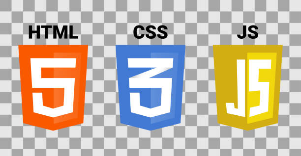

### Hi there 👋

 ⚡  ⚡  ⚡  ⚡  ⚡  ⚡  ⚡  ⚡  ⚡  ⚡  ⚡  ⚡  ⚡  ⚡  ⚡  ⚡  ⚡  ⚡  ⚡  ⚡  ⚡  ⚡
 
- 🔭 Ben,çalıştığım firma olan İzmad Bilişim (Waaynet) için masaüstü uygulama geliştiriyorum.
- 🌱 Aynı zamanda Udemig'den Frontend React eğitimi alıyorum.
- 💬 Bana hulya.bayik@hotmail.com ve
- 💬 linkedin.com/in/hulyabayik/ dan ulaşabilirsiniz

⚡  ⚡  ⚡  ⚡  ⚡  ⚡  ⚡  ⚡  ⚡  ⚡  ⚡  ⚡  ⚡  ⚡  ⚡  ⚡  ⚡  ⚡  ⚡  ⚡  ⚡  ⚡

